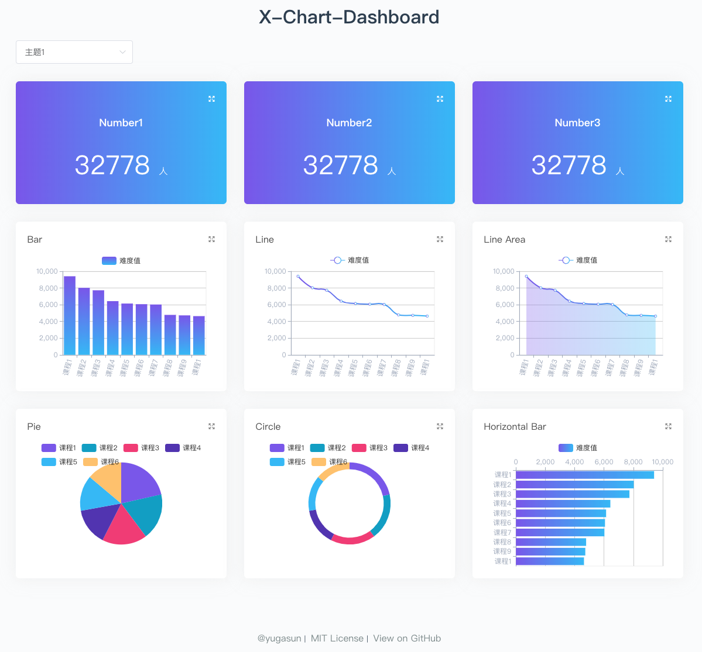

<p align="center">
  
</p>

<p align="center">
    <a href="https://vuejs.org/">
        
    </a>
    <a href="https://echarts.apache.org/">
        
    </a>
    <a href="https://vitejs.dev">
        
    </a>
    <a href="https://pinia.vuejs.org">
        
    </a>
    <a href="https://www.typescriptlang.org/">
        
    </a>
</p>

[简体中文](./README.zh-CN.md) | English

## Introduction

`x-chart` is a draggable & resizable data visualization dashboard. Based on [Vue.js](https://github.com/vuejs/vue), [vue-echarts](https://github.com/ecomfe/vue-echarts) and [vue-grid-layout](https://github.com/yugasun/vue-grid-layout/tree/pro/compass).

> **Notice** This version is rewrote by `typescript`, if you want the old version by `javascript`, you can checkout tag `v0.1.2`.

## Develop

```bash
# clone the project
git clone https://github.com/yugasun/x-chart.git

# install dependency
pnpm install

# develop
pnpm run dev

# build
pnpm run build

# deploy for Github page
pnpm run deploy

# build docker image
pnpm run docker:build

# run docker image in container, after this you can visit demo by: http://localhost:8080
pnpm run docker:run

# run into current docker container
pnpm run docker:exec
```

## Feature

-   [x] Base on template [vue-ts-starter](https://github.com/yugasun/vue-ts-starter) (Vue3 + Vite + TypeScript)
-   [x] Configurable dashboard: all modules render depend on the api.
-   [x] Chart modules are draggable and resizable.
-   [x] Customized and beautify charts using echarts.
-   [x] Frontend data mock demo using [msw](https://mswjs.io/docs/) Seamless REST/GraphQL API mocking library for browser and Node.js.
-   [x] Docker deploy.

## Demo



[Online Preview](https://x-chart.vercel.app/).

## Notice

For Chinese if you `npm install` slowly, you can create `.npmrc` file with below content:

```shell
registry=https://registry.npm.taobao.org/
phantomjs_cdnurl=http://cnpmjs.org/downloads
sass_binary_site=https://npm.taobao.org/mirrors/node-sass/
```

## License

[MIT](./LICENSE)

Copyright (c) 2018-present yugasun
