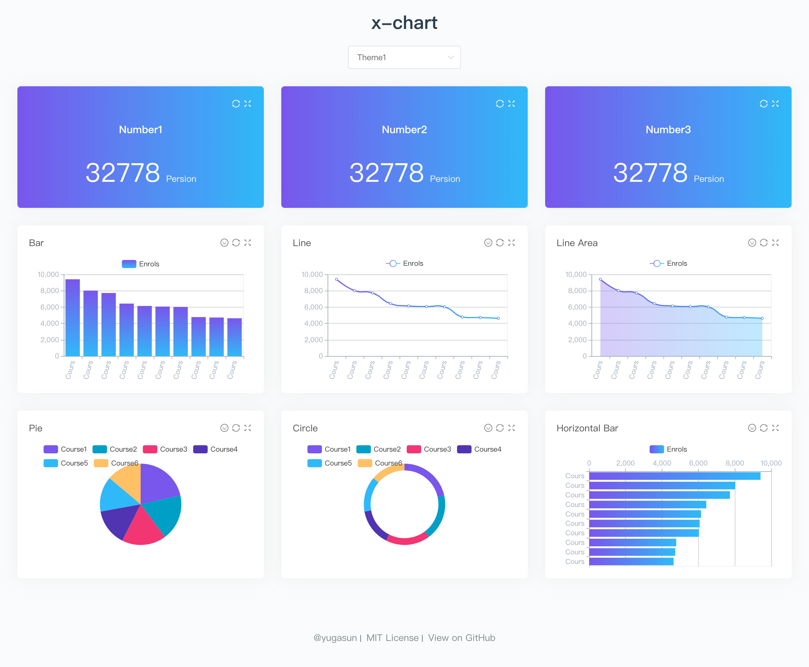

<p align="center">
  
</p>

简体中文 | [English](./README.md)

## 简介

`x-chart` 是一个可拖拽/放大缩小的数据可视化系统。基于 [Vue.js](https://github.com/vuejs/vue), [vue-echarts](https://github.com/ecomfe/vue-echarts) 和 [vue-grid-layout](https://github.com/yugasun/vue-grid-layout/tree/pro/compass) 开发。

## 开发

``` bash
# 克隆项目
git clone https://github.com/yugasun/x-chart.git

# 安装依赖
npm install

# 启动服务
# 浏览器访问 http://localhost:8080
npm run dev

# 构建
npm run build

# 构建 docker 镜像
npm run docker:build

# 运行 docker 镜像
npm run docker:run
```

## 功能

- [x] 可配置的展示板: 所有模块均基于接口渲染。
- [x] 可拖拽和放大缩小的图形模块。
- [x] _**使用 [bowl.js](https://github.com/ElemeFE/bowl) 对前端静态文件（js，css）进行缓存，注入到 localStorage。**_
- [x] 自定义和美化的echarts图形。
- [x] 使用 [mockjs](https://github.com/nuysoft/Mock) 进行前端数据模拟。
- [x] Docker部署方案.

## Demo



[Online Preview](http://yugasun.github.io/x-chart).

## License

[MIT](https://github.com/yugasun/x-chart/blob/master/LICENSE)

Copyright (c) 2018-present yugasun
